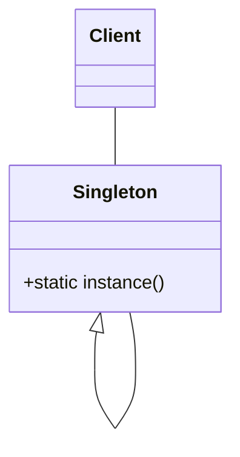
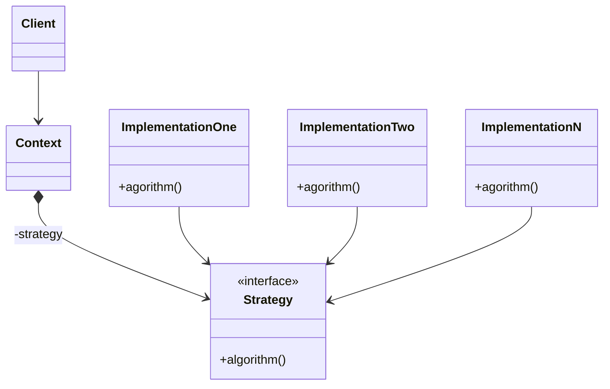
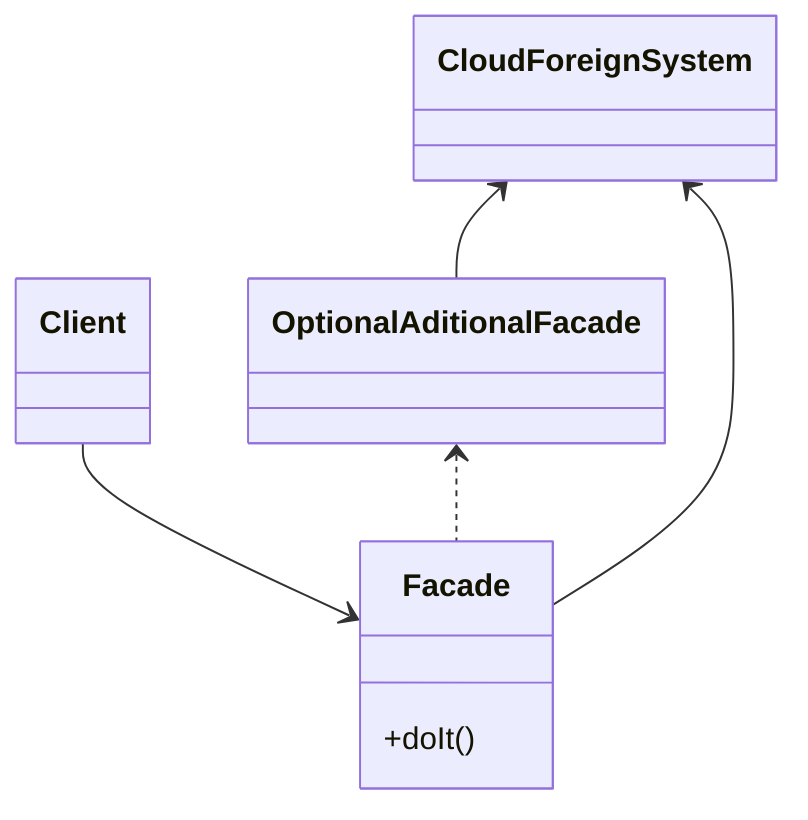
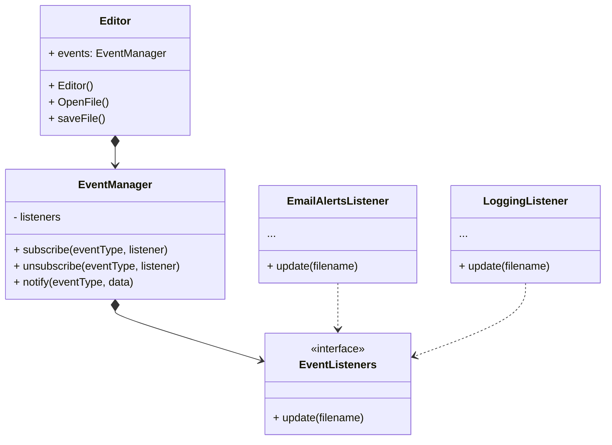

# Hands-On |  JAVA Design Pattern
  
  

## About patterns

The design patter is one model that help us when we want to use best practice over our code avoid duplication, complexity and so on.  
In this hands-on I to use three os more common design patterns:

**Creational**
* [Singleton](#singlenton)

**Structural**
* [Strategy](#strategy)

**Behavioral**
* [Facade](#facade)
* [Observer](#observer)

## Singlenton
To create a unique instance of class with a way how to use.

## Strategy
For the same problem, to simplificating the variation code.

## Facade
With interfaces to reduce the complex integrations with to subsystem.

## Observer
We can define a subcription mechanism to notify multiple objects about any evetos that happen to the object they're oberving.

